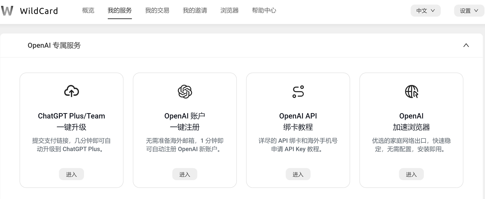
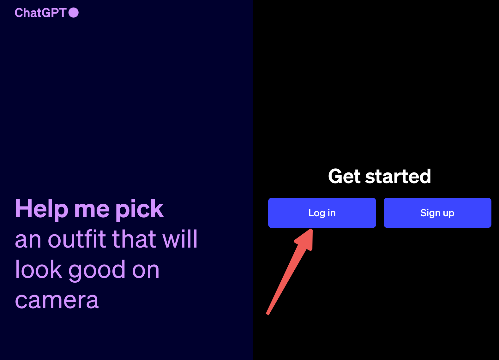
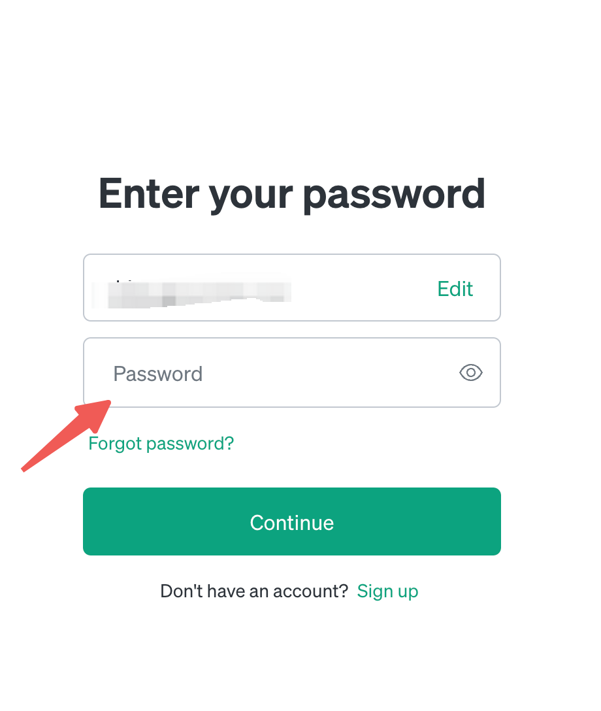
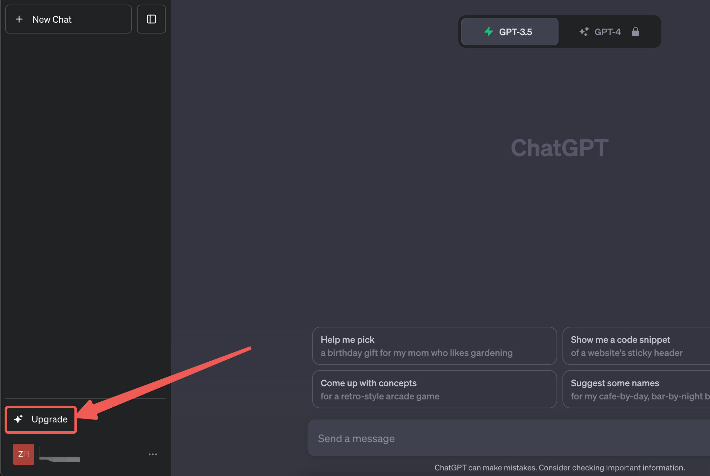
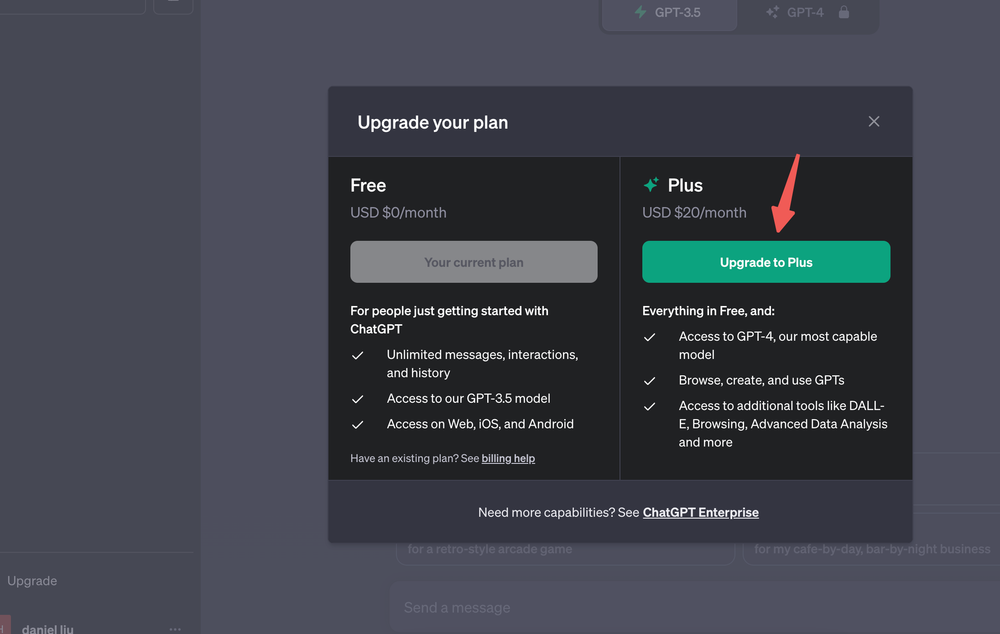
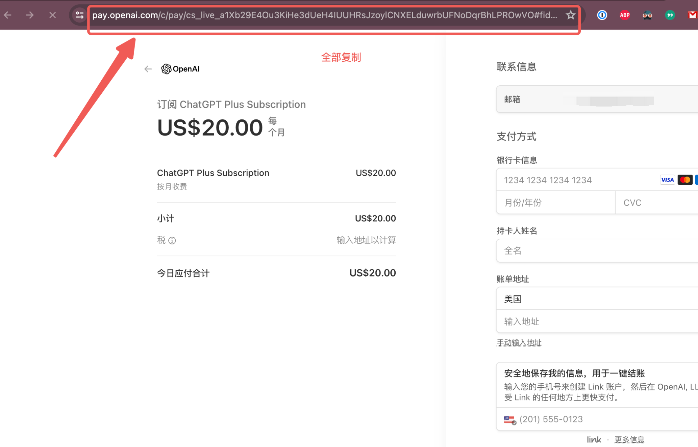
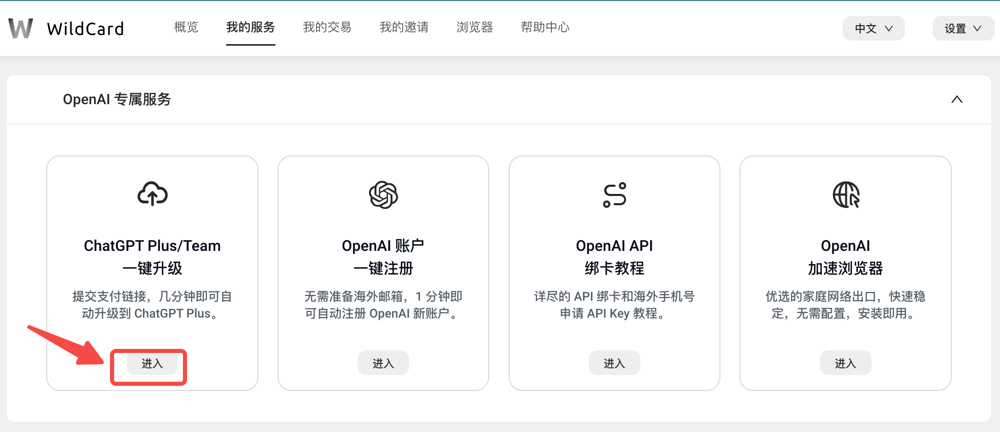
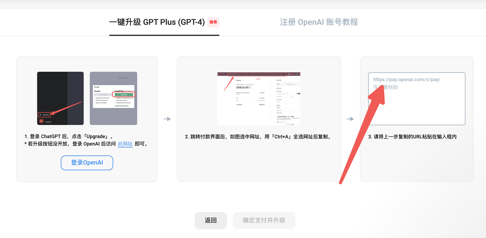
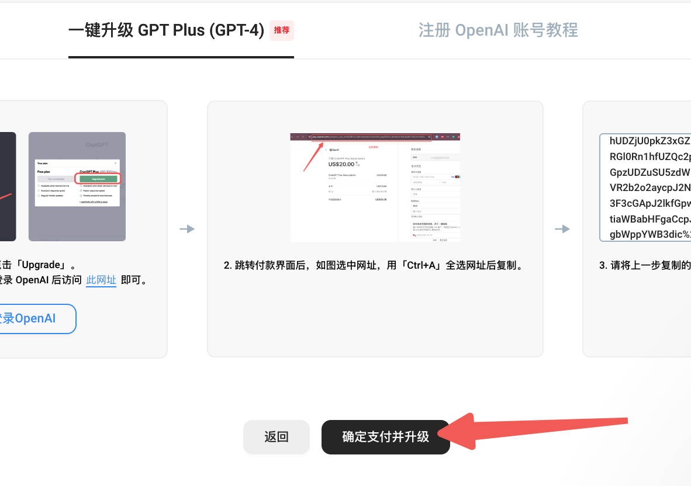

# &#x20;国内如何升级GPT4,告别昂贵代充

## &#x20;一.GPT4的作用

（PS:一键注册可以去 [https://bewildcard.com/i/888GPT888](https://bewildcard.com/i/GPT888) 输入888GPT888邀请码可以抵扣2美元）

1.  解锁更强的对话功能,解锁更快的对话体验
2.  解锁数万种定制化GPT 无论是论文,牙医,做饭,教学,覆盖各行各业
3.  解锁GPT绘图功能生成你想要的精美图片
4.  解锁数万种插件,gpt通过自己的理解调用其他app为你服务
5.  解锁数据处理,直接由gpt云服务器帮你完成数据处理,excel编辑等工作

**这也是我目前工作的绝对利器**

## &#x20;二. 如何充值GPT4

升级到 ChatGPT 4.0 的过程可能会遇到一些挑战，主要是因为支付和网络访问的限制。要完成这一升级，用户不仅需要拥有可以在国外使用的VISA或MasterCard双币信用卡，还必须保证其网络连接来源是干净且使用较少的国外IP地址（即通过安全且人流较少的网络代理）。此外，ChatGPT 的支付处理是通过Stripe来完成的，Stripe会利用账单地址、IP地址等信息进行风险控制，这导致许多位于国内的支付尝试往往被自动阻止。

在尝试支付过程中，用户经常会遇到如下的错误提示信息：

*   “Your credit card was declined.Try paying with a debit card instead.”（您的信用卡被拒绝了。请尝试用借记卡支付。）

这些支付和访问上的限制给希望升级至ChatGPT 4.0的用户带来了不小的困扰。

当然在我的努力下也是成功开通

img1

### **一键开通方法**

1.前往WildCard网站开通国外虚拟银行卡(国外大部分支付方式都是银行卡或paypal,开通后可以支付大部分的付费功能 midjoureny,onlyfans等)

注册链接:[https://bewildcard.com/i/888GPT888](https://bewildcard.com/i/GPT888)

**输入888GPT888邀请码可以抵扣2美元**

注册完成后页面如下:\

接下来我们便去登录gpt官网

2.登录gpt官网

(免费版GPT3.5账号还没有的可以看我另外一篇教程 xxx 或直接网站购买一个账户)

依次点击 Login ，输入邮箱和密码

3.点击升级

在登录到OpenAI账户之后，您可以在界面左下角找到并点击“Upgrade to Plus”按钮。在随后出现的弹窗中，选择“Upgrade plan”进行升级。

如果升级入口无法点击，那就访问这个网址，<https://chat.openai.com/invite/accepted> 进入支付页面。

4.获得升级支付的网址

在支付页面，复制现在的付款页网址 URL，这一段\*\* pay.openai.com\*\* 开头的全部网址，进入我们「一键升级 ChatGPT Plus」页面，提交就可以了。**不要在支付页面填写任何信息**，**填写信息可能导致报错,**如果填写过，请返回上一步，重新进入这个页面再复制网址.

5.返回wildCard

点击一键升级

在输入框，粘贴刚刚复制的支付页面的网址，然后点击确定支付并升级。

**最后选择使用的虚拟银行卡升级就可以了(注意:要保证银行卡内余额大于20美元)**

## &#x20;如果你觉的充值复杂,或环境受限可以联系微信直接购买成品账号

