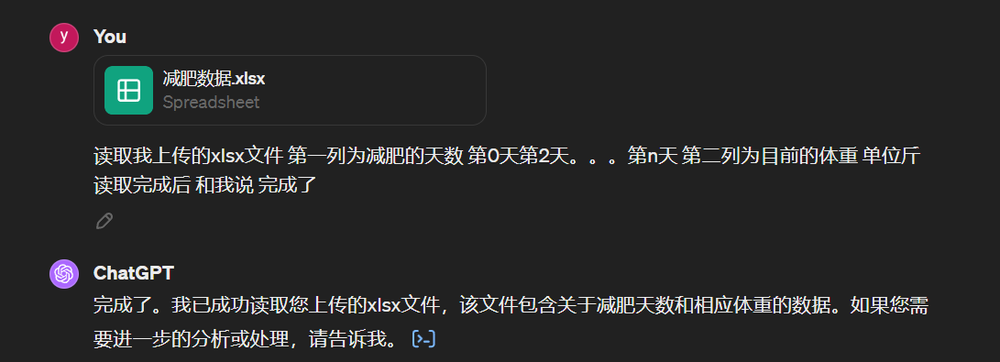
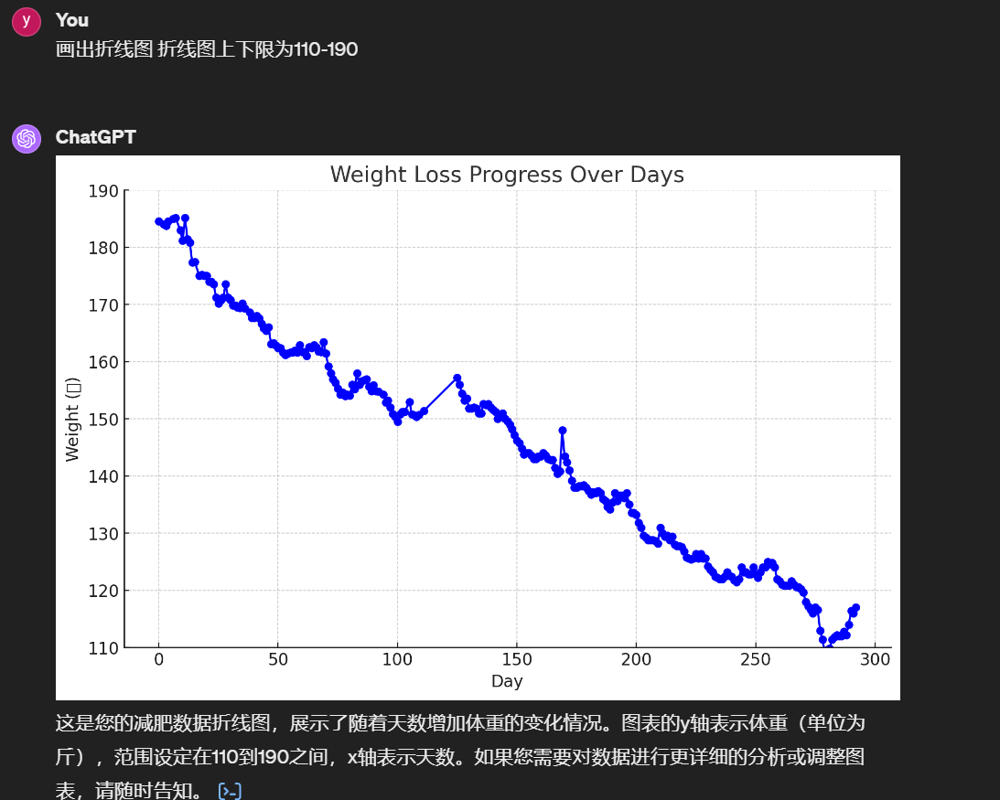
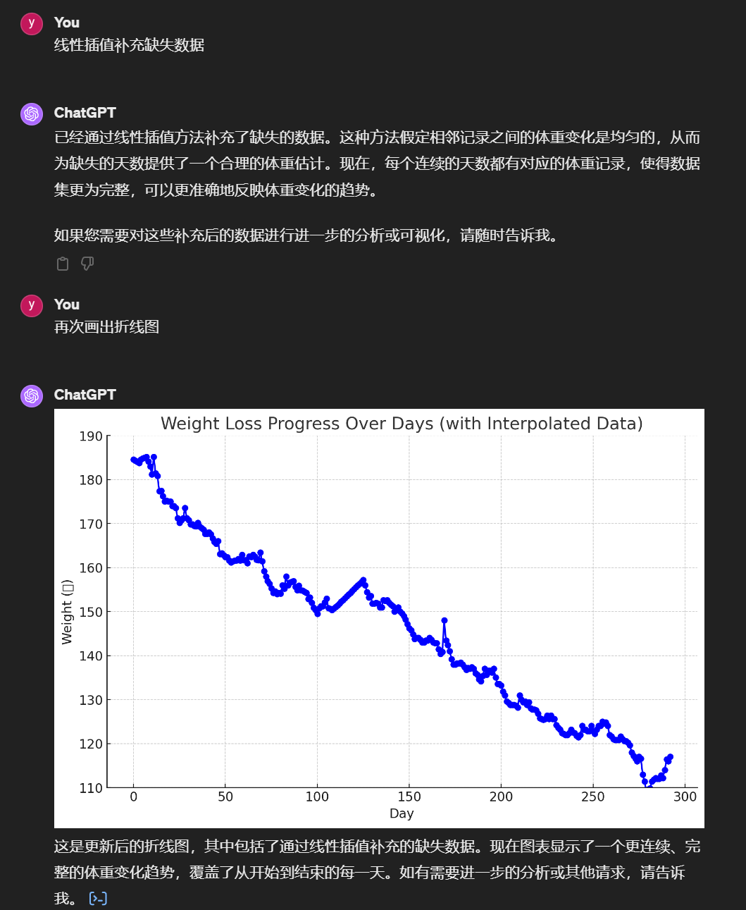
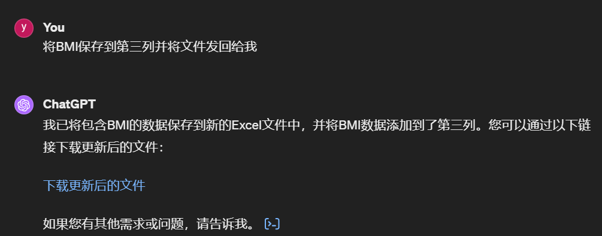
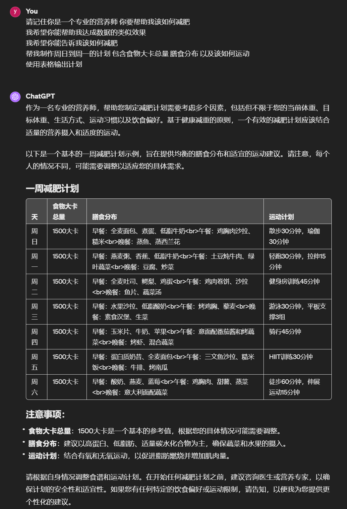

wln -> weight loss nutritionist
减肥营养师
# 让GPT参与数据分析并做你的减肥营养师
还不知道怎么升级GPT4的可以点击：[GP4升级指南](../Recharge_tutorial/gpt4rt.md)

GPT3.5注册教程

## 1.给出你的减肥数据或目标期望(数据可以没有)：

当我们使用GPT的数据处理功能时,注意一定要分两步(经验总结),很多时候文件过大,GPT可能会偷懒并没有真正的读取到文件。

## 2.让其对数据进行分析,画出折线图等
** 本文不仅仅是一个教你如何做减肥营养师 也是教你如何利用GPT处理数据，举一反三，未来可以运用到论文,工作数据中 **

输入命令以及你想让它画出的折线图要求 我们这里是110-190 因为本次体重变化就在这个范围内

同时还可以让GPT对数据进行计算

这里我们让gpt计算BMI并画出折线图 

也可以让GPT对你的文件进行修改 并发回给你 

## 3.让GPT作为营养师,同时还能获取之前的数据

提示词:
请记住你是一个专业的营养师 你要帮助我该如何减肥
我希望你能帮助我达成数据的类似效果
我希望你能告诉我该如何减肥
帮我制作周日到周一的计划 包含食物大卡总量 膳食分布 以及该如何运动
使用表格输出计划
(可以自行修改)

